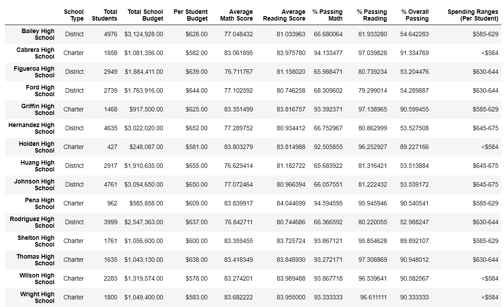

# School_District_Analysis

## Project Overview:

The school board has noticed evidence of academic dishonesty within the Thomas High School ninth graders.  To uphold state-testing standards we have been contacted by Maria to replace the math and reading scores with NaNs (not a number) for the Thomas School ninth graders.  We have set out to complete the following:

1. Replace reading and math scores to NaNs for Thomas High School ninth grade.
2. Repeat the district summary with updated data.
3. Repeat the school summary with updated data.
4. Find the new overall passing rate for the top 5 and bottom 5 performing schools.
5. Find the new average reading and math score for each grade level from each school
6. Find the new scores by school for spending per student, by school size, and by school type
7. Compare the new results with the previous results

## Resources:

 Data Source: [students_complete.csv](Resouces/students_complete.csv)
 
 Software: Jupyter Notebook, Anaconda 4.10.1, Python 3.7.6, Visual Studio Code, 1.56.0
 
 Code: [PyCitySchools_Challenge.ipynb](PyCitySchools_Challenge.ipynb)

## School_District_Analysis Results:

### Showing reading and match scores for Thomas High School have been replaced with NaNs values.

### The new district summary vs the previous district summary.

### The new school summary vs the previous school summary.

### The new Top 5 and Bottom 5 schools.

### The new average reading and math score for each grade level from each school

### The new scores by school for spending per student, by school size, and by school type.

+

## School_District_Analysis Summary:

There were 461 grade nine students at Thomas High School that had their marks in reading and math changed to NaNs.  This affected the scores very little in every category we tracked with the largest decline at 0.03%.

Average Math = 0.01% decline  
Average Reading = stayed the same  
% Passing Math = 0.02% decline  
% Passing Reading = 0.03% decline  
% Overall Passing = 0.01% decline  

The overall funding levels per student, per school, and per school type were not changed.  I believe the school board will be happy with their choice of using NaNs for the grade nine students.  The state-testing standards have been upheld.  

